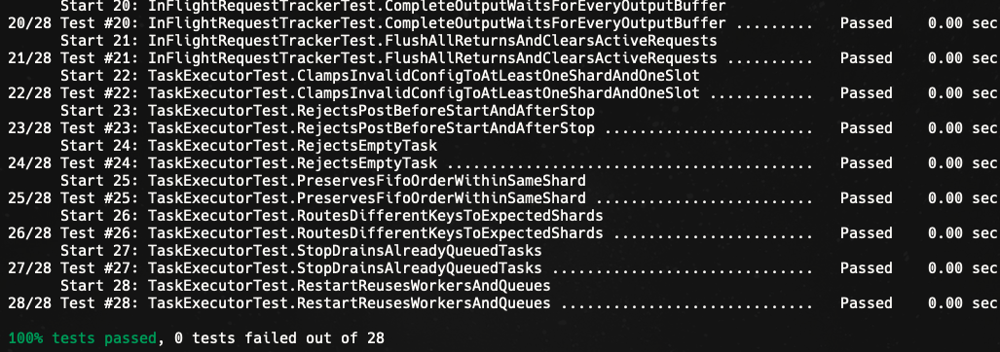
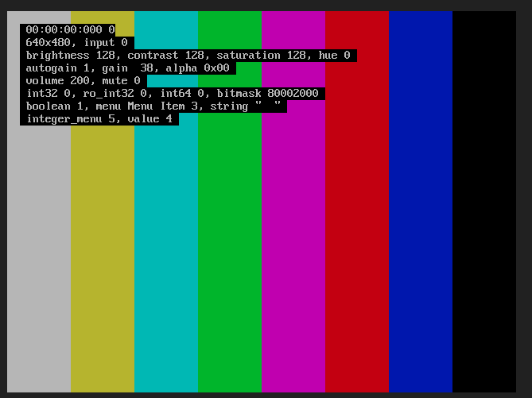

# MiniCam HAL

MiniCam HAL is a C++20 Linux camera HAL (Hardware Abstraction Layer)-style
runtime. It models how a camera userspace layer coordinates framework requests,
app-owned output buffers, V4L2 driver completions, preview streaming, and still
capture.

This is not an Android Camera HAL implementation. It is a small, runnable model
of the HAL/driver boundary using Linux V4L2 `vivid`, `epoll`, `ioctl`, and
`dma-buf` backed output buffers.

## Why This Project

I built this project to practice systems programming at a concrete
hardware/software boundary:

- Linux userspace programming with file descriptors, `ioctl`, `epoll`, and
  async event dispatch
- V4L2 driver interaction through `QBUF`, `DQBUF`, `STREAMON`, and `STREAMOFF`
- Camera HAL (Hardware Abstraction Layer) concepts such as request/result
  mapping, stream routing, and buffer ownership
- Mobile camera performance patterns such as asynchronous completion,
  zero-copy-style `dma-buf` handoff, and backpressure-aware task queues

Camera is one of the most important mobile system modules because it crosses
apps, framework APIs, vendor HAL code, kernel drivers, image processing, memory
bandwidth, latency, and power constraints. This project focuses on that
coordination layer.

## Table of Contents

- [Architecture & Mental Model](#architecture--mental-model)
  - [Camera Stack](#camera-stack)
  - [Why The HAL Layer Is Important](#why-the-hal-layer-is-important)
  - [Request & Result Lifecycle](#request--result-lifecycle)
- [Implementation](#implementation)
  - [Runtime](#runtime)
  - [CameraDeviceSession](#cameradevicesession)
  - [DMA Buffer Ownership](#dma-buffer-ownership)
  - [DriverAdapter](#driveradapter)
  - [V4L2 Backend](#v4l2-backend)
  - [Application Demo Layer](#application-demo-layer)
- [Project Layout](#project-layout)
- [How To Use](#how-to-use)
  - [Build & Test](#build--test)
  - [Preview Demo](#preview-demo)
  - [Still Capture Demo](#still-capture-demo)
- [What This Simulates](#what-this-simulates)
- [What Is Simplified](#what-is-simplified)
- [What A Real Android Camera HAL Does](#what-a-real-android-camera-hal-does)

## Architecture & Mental Model

### Camera Stack

A real Android camera path looks roughly like this:

```text
Android app
  -> Camera Framework
  -> Camera HAL
  -> Kernel driver / V4L2
  -> ISP / sensor / camera device
```

Responsibilities are split across layers:

- Camera Framework: exposes high-level camera APIs to applications
- HAL (Hardware Abstraction Layer): coordinates vendor/device-specific behavior,
  routes framework requests to streams, manages buffer handoff, translates
  driver completions, and returns results
- Driver: owns low-level device I/O and talks to the camera device

MiniCam uses a simplified architecture shaped like the same stack, with the
focus on the HAL layer and HAL/driver boundary:

```text
CLI framework-like client
  -> CameraHalRuntime / CameraDeviceSession
  -> DriverAdapter
  -> V4L2 vivid driver
  -> virtual camera device
```

### Why The HAL Layer Is Important

The HAL layer is important because it sits between the camera framework and the
driver. It talks to the driver, but the driver only exposes low-level
asynchronous device I/O. That creates several problems the HAL has to solve:

- The driver does not know framework request context. It mainly knows which
  buffer should receive the next frame, not which app request, output target, or
  metadata state that buffer belongs to.
- Driver completion is asynchronous. Once buffers are queued, the HAL has to
  track in-flight requests until the driver later reports that a buffer is done.
- A camera session may involve multiple device file descriptors. Preview, still
  capture, or logical multi-camera paths can complete independently, so the HAL
  needs an event loop to watch and drain multiple driver fds.
- The HAL itself must be asynchronous. Framework calls should enqueue work and
  return quickly instead of blocking on sensor exposure, ISP work, driver
  readiness, or image processing.
- Completed buffers are still raw image data for the next stage of the pipeline.
  The HAL has to coordinate where ISP output, JPEG encoding, postprocessing, or
  vendor-specific modules run before returning final results. In a real camera
  stack, those stages are asynchronous: the HAL has to pass acquire fences into
  stages that consume a buffer, collect release fences from stages that produce
  a buffer, and chain those fences so the next processor or app only touches
  memory after the previous stage has completed.

```text
Camera Framework submits CaptureRequest
  -> HAL validates stream targets, acquire fences, and in-flight frame state
  -> HAL queues output buffer fds to the driver through V4L2 ioctl calls
  -> Driver fills buffers asynchronously
  -> HAL event loop wakes on driver fd readiness
  -> HAL dequeues completed buffers and restores request context
  -> HAL runs output processors and chains their async release fds
  -> HAL returns CaptureResult to the framework through callback
```

MiniCam models HAL with:

- `CameraHalRuntime`: process-level event loop, task executor, and `dma-buf`
  pool
- `CameraDeviceSession`: per-camera request/result lifecycle and stream
  semantics
- `DriverAdapter`: backend abstraction for mock and V4L2 drivers
- `OutputProcessor`: ordered asynchronous output stages such as JPEG encode
  or postprocessing, with release fd handoff
- `InFlightRequestTracker`: frame/output bookkeeping while requests are active
- `TaskExecutor`: sharded worker pool for ordered per-session async execution
- `EpollEventLoop`: readiness notifications from V4L2 file descriptors

The most important runtime path starts when the HAL receives a capture request.
At that point, the HAL has to build request context around framework-owned DMA
buffers, send those buffers to the driver, and later collect one or more
completed outputs back into the correct framework callback.

### Request & Result Lifecycle

A capture request is more than "take a picture." It is a bundle of intent,
metadata, and output memory. The framework side owns the output buffers; the HAL
does not allocate image memory for every request. Instead, it receives buffer
file descriptors, records which frame and output each buffer belongs to, queues
them to the driver, and restores that context when completions arrive.

The request/result lifecycle looks like this from the framework-owned buffer
handoff to the final release fence returned to the app:

```text
Framework/app submits request + output buffer fds + acquire fences
  -> HAL records frame/output metadata and queues buffers to V4L2
  -> Driver fills buffers and reports completions asynchronously
  -> HAL maps completions back to requests and runs output processors
  -> HAL returns CaptureResult with final release fences
  -> Framework/app waits release fences, then reads the outputs
```

Expanded step by step:

```text
1. Framework/app owns reusable DMA output buffers
2. Framework builds CaptureRequest(frame_number, output_buffers[]), where each
   output buffer may include an acquire_fence_fd
3. HAL validates the request and records frame_number -> output_index -> buffer_id
4. HAL waits each acquire_fence_fd before queueing that buffer to the driver
5. HAL queues each buffer fd to V4L2 with VIDIOC_QBUF
6. Driver owns the queued buffers and fills them asynchronously
7. epoll wakes when one of the V4L2 fds has a completed buffer
8. HAL calls VIDIOC_DQBUF and receives a low-level driver completion
9. HAL maps the completion back to frame_number/output_index/buffer_id
10. HAL schedules ordered output processors for each completed output
11. Each processor receives the previous stage's release fd as its input
    acquire fd and immediately returns a new release_fence_fd for its own
    asynchronous work
12. HAL collects completed outputs for that frame
13. HAL returns CaptureResult(frame_number, completed buffers, final output
    release fences)
    through callback
14. Framework/app waits each completed output's final release_fence_fd before
    reading that output
15. Framework/app releases reusable buffers later
```

During that lifecycle, different layers use different request metadata fields
to track ownership, driver I/O, and readiness. The metadata is structured like
this:

```text
frame_number
  Request id assigned by the framework.
  One frame_number represents one CaptureRequest.
  One request can contain multiple output buffers, such as preview + still.

  output_index
    Per-output-buffer index inside that request.
    Each output buffer contains several metadata fields, such as:

    buffer_id
      Stable framework/app-visible identity for the reusable buffer slot.
      This is used for bookkeeping and for returning the right buffer to the
      app/framework.

    buffer_fd
      Kernel dma-buf file descriptor for the memory behind that buffer slot.
      This is the handle imported by V4L2 with VIDIOC_QBUF.

    acquire_fence_fd
      An fd that must signal before the HAL/driver writes to the buffer.
      MiniCam waits this before QBUF because standard V4L2 capture queues do
      not carry Android-style acquire fences directly.

    release_fence_fd
      An fd returned in CompletedOutputBuffer. The app waits this before
      reading the processor output. MiniCam's processor fences are pollable
      pipe-backed async fds, not hardware dma_fence/sync_file fds.
```

Example still capture flow:

```text
CaptureRequest(frame #42)
  output[0]:
    stream_id = 2
    output_index = 0
    buffer_id = 42
    buffer_fd = 17
    acquire_fence_fd = 21
  output[1]:
    stream_id = 3
    output_index = 1
    buffer_id = 43
    buffer_fd = 18
    acquire_fence_fd = 22
        |
        v
HAL in-flight table:
  frame #42 -> output_index 0 -> buffer_id 42
            -> output_index 1 -> buffer_id 43
        |
        v
wait acquire_fence_fd 21/22
        |
        v
V4L2 QBUF(fd=17), QBUF(fd=18)
        |
        v
epoll -> DQBUF
        |
        v
DriverCompletion(frame #42, output_index 0, buffer_id 42)
        |
        v
OutputProcessor waits input acquire fd and returns release_fence_fd
        |
        v
HAL repeats for output_index 1, then returns:
CaptureResult(frame #42,
              completed buffer_id 42 + release_fence_fd,
              completed buffer_id 43 + release_fence_fd)
```

Example preview flow:

```text
HAL pre-queues preview buffers
  -> V4L2 continuously produces frames
  -> each DQBUF dispatches a preview result
  -> callback reads the preview buffer
  -> HAL returns the same buffer with QBUF
```

The preview buffer is returned to V4L2 only after the callback finishes reading
it. That models the ownership rule: the driver should not refill a buffer while
the app/HAL side is still consuming it.

## Implementation

### Runtime

`CameraHalRuntime` owns process-level resources:

- `EpollEventLoop` watches one or more V4L2 file descriptors
- `TaskExecutor` uses shard workers backed by bounded MPSC ring queues; tasks
  with the same session id route to the same worker to preserve ordering.
- `DmaBufPool` allocates reusable `dma-buf` backed output buffers

This keeps `CameraDeviceSession` focused on camera semantics instead of owning
its own event loop or permanent worker thread.

### CameraDeviceSession

`CameraDeviceSession` owns the per-camera lifecycle:

- configure streams
- start preview streaming
- accept framework-style `CaptureRequest` objects
- track in-flight frame/output mappings
- run ordered output processors after driver completion
- chain processor acquire/release fds across the output pipeline
- dispatch `CaptureResult` callbacks
- flush and close active requests

Session code treats driver completions as async events. A completion only
becomes a result after it is mapped back to the original frame and output.
For each completed output, the session passes the current release fd into the
next `OutputProcessor` as that processor's input acquire fd. The final
processor release fd is stored in `CompletedOutputBuffer::release_fence_fd` and
returned to the app callback.

MiniCam includes a `JpegEncoderProcessor` to model an asynchronous encode stage.
It encodes JPEG bytes into an in-memory store and signals a pollable fd when that
encoded payload is ready. The app-side `FenceAwareResultWriter` registers the
result/path mapping, blocks on the returned fd, and writes the encoded bytes to
disk.

### DMA Buffer Ownership

The point of DMA buffer ownership is zero-copy image handoff. The framework/app
allocates `dma-buf` backed output buffers and passes `buffer_id`, `buffer_fd`,
and `buffer_size` into the request. The HAL passes `buffer_fd` to the driver
instead of copying image payload through userspace memory. The V4L2 backend
queues those fds with `V4L2_MEMORY_DMABUF`.

Ownership moves like this:

```text
App holds a DmaBufLease for a pool-owned output buffer
  -> HAL receives buffer_fd in CaptureRequest
  -> V4L2 owns/fills buffer after QBUF
  -> HAL receives DQBUF completion
  -> HAL returns CaptureResult(buffer_id) through callback
  -> App reads mapped buffer
  -> DmaBufLease destructor returns the buffer to DmaBufPool
```

This is intentionally closer to real camera systems: large image frames move by
buffer ownership transfer, while callbacks carry metadata and buffer ids.

### DriverAdapter

`DriverAdapter` hides backend-specific mechanics from the session:

- `MockDriverAdapter` provides deterministic completions for unit tests
- `V4L2DriverAdapter` implements real V4L2 `ioctl` calls
- `V4L2MultiStreamDriverAdapter` routes preview and still streams to different
  V4L2 capture fds

The session talks to the adapter in terms of output buffers and completions. It
does not know whether the backend is mock or V4L2.

### V4L2 Backend

The V4L2 backend is where HAL requests become Linux driver ABI calls. It uses
`ioctl` to configure the device, queue DMA buffers, start streaming, and dequeue
completed frames.

Initialization is the setup path:

```text
open("/dev/videoX")
  -> VIDIOC_QUERYCAP     check that the fd is a V4L2 capture device
  -> VIDIOC_S_FMT        set pixel format, width, height, and bytes per line
  -> VIDIOC_REQBUFS      ask the driver to create N queue slots
                         with memory = V4L2_MEMORY_DMABUF
```

The runtime path is an in-queue / out-queue loop:

```text
HAL has buffer_fd for the leased dma-buf
  -> VIDIOC_QBUF         enqueue buffer_fd into a driver queue slot
  -> VIDIOC_STREAMON     start device streaming after buffers are queued
  -> driver / ISP fills queued buffers asynchronously
  -> epoll readiness     fd becomes readable when a buffer completes
  -> VIDIOC_DQBUF        dequeue one completed buffer
  -> HAL restores frame_number/output_index/buffer_id context
  -> HAL returns CaptureResult through callback
```

Note: this queue/dequeue model is the V4L2 userspace completion contract, not a
claim that every ISP or camera driver is internally implemented as a simple
submit queue and completion queue. A real driver may use hardware descriptor
rings, DMA interrupts, firmware queues, media-controller graphs, request APIs,
or internal fences. Standard V4L2 capture still exposes buffer completion to
userspace as `epoll`/`poll` readiness followed by `VIDIOC_DQBUF`, which returns
ownership of the completed buffer.

Ownership alternates at the queue boundary:

```text
before QBUF: HAL/framework side can write/read buffer metadata
after QBUF:  driver owns the buffer and may write image bytes
after DQBUF: HAL/framework side owns the completed buffer again
```

Shutdown is explicit:

```text
VIDIOC_STREAMOFF
  -> stop streaming
  -> return any queued buffers to userspace ownership
  -> close fd
```

V4L2 supports multiple memory models. The two most relevant ones here are:

- `V4L2_MEMORY_MMAP`: the driver allocates capture buffers, userspace maps them
  with `mmap`, and the app reads frames from driver-owned memory.
- `V4L2_MEMORY_DMABUF`: userspace provides external DMA buffer file descriptors,
  and the driver imports those fds as capture targets.

MiniCam uses `V4L2_MEMORY_DMABUF` because it better models a camera HAL
zero-copy contract. The framework/app side can own reusable output buffers, the
HAL can pass only fds through `VIDIOC_QBUF`, and the driver can write captured
frames directly into those buffers. Compared with `MMAP`, this makes ownership
handoff explicit and avoids copying large image payloads through result objects
or intermediate userspace buffers.

Preview and still are modeled as separate endpoints:

```text
/dev/video0 -> preview stream
/dev/video4 -> still capture stream
```

The Vagrant VM uses the Linux `vivid` test driver with `n_devs=2` to expose two
capture nodes.

### Application Demo Layer

The CLI app is intentionally thin. It demonstrates how a framework-like client
would use the HAL:

- initialize `CameraHalRuntime`
- allocate output buffers from the runtime `DmaBufPool`
- register buffers in app-side `BufferTracker`
- collect async results through `FenceAwareResultWriter`
- write completed preview/still buffers to JPEG artifacts

## Project Layout

```text
interface/   Public request/result/device contracts
hal/         Runtime, session, V4L2 adapter, dma-buf pool, task executor
app/         CLI demo, buffer tracking, result collection, image writing
tests/       GoogleTest coverage
```

## How To Use

### Build & Test

Inside the Vagrant VM:

```sh
make test
```

From the host, run the same Linux test suite through Vagrant:

```sh
make vagrant-test
```



### Preview Demo

Capture preview frames from the continuous preview stream and export JPEG
artifacts on a macOS host:

```sh
make preview-v4l2-jpg
```

Outputs:

```text
artifacts/minicam-preview.jpg
```

Example V4L2 `vivid` output:



### Still Capture Demo

Run preview in the background, submit one still capture request, and export JPEG
artifacts on a macOS host:

```sh
make capture-v4l2-jpg
```

Outputs:

```text
artifacts/minicam-capture.jpg
```

Raw smoke targets are also available:

```sh
make vagrant-preview-v4l2
make vagrant-capture-v4l2-multifd
```

## What This Simulates

MiniCam models:

- HAL-style request/result lifecycle
- preview streaming vs still capture coordination
- async driver fd readiness through `epoll`
- async fence-like fd coordination between app, HAL, and output processors
- V4L2 buffer ownership transfer through `QBUF` / `DQBUF`
- `dma-buf` fd handoff
- ordered output processor pipeline with release fd propagation
- multi-stream routing
- in-flight frame/output bookkeeping
- callback-driven buffer recycle for preview

## What Is Simplified

MiniCam keeps the shape of a camera HAL pipeline while replacing production
Android and hardware pieces with smaller learning-oriented equivalents:

- Android AIDL/HIDL service interfaces are represented by direct C++ session
  calls and callbacks.
- Gralloc buffer handles are represented by app-owned `dma-buf` fds and stable
  `buffer_id` values.
- Android sync fences and hardware `dma_fence` / `sync_file` fds are represented
  by pollable pipe-backed async fds.
- ISP, JPEG, and postprocessing hardware are represented by an ordered
  `OutputProcessor` pipeline and a CMake-fetched `jpge` JPEG encoder processor.
- AE/AWB/AF, lens controls, and sensor metadata are reduced to minimal frame
  timing and status metadata.
- Android partial results and notify/error callback split are collapsed into one
  final `CaptureResult` callback per frame.
- CTS/VTS compatibility and a real Pixel camera pipeline are out of scope.
- The V4L2 device is Linux `vivid`, so images are synthetic test patterns rather
  than real sensor frames.

## What A Real Android Camera HAL Does

MiniCam focuses on the HAL/driver lifecycle. A production Android Camera HAL has
the same core request/result problem, but it also has to integrate with Android
framework contracts and vendor image pipelines.

In a real Android camera stack, the HAL typically does more than this project:

- Exposes the Android Camera HAL service interface through AIDL or older HIDL
- Implements framework entry points such as capture request submission, stream
  configuration, flush, result callbacks, and notify callbacks
- Accepts framework stream buffers backed by gralloc/native buffer handles
- Handles acquire and release sync fences for raw image buffers that move across
  modules, processes, and hardware engines such as Camera/ISP, GPU/display,
  video encoder, and app/ImageReader consumers
- Converts framework metadata into sensor, lens, ISP, and vendor pipeline
  controls
- Coordinates 3A state such as auto-exposure, auto-white-balance, and
  auto-focus
- Routes outputs through ISP, JPEG encode, postprocessing, or vendor-specific
  image enhancement modules
- Returns partial metadata, final capture results, shutter notifications, and
  error notifications using Android's expected callback ordering
- Meets Android compatibility requirements such as CTS/VTS behavior

This project intentionally models the lower-level systems part underneath those
Android interfaces: request tracking, zero-copy buffer handoff, async driver
completion, multi-fd event handling, and result callback mapping.
